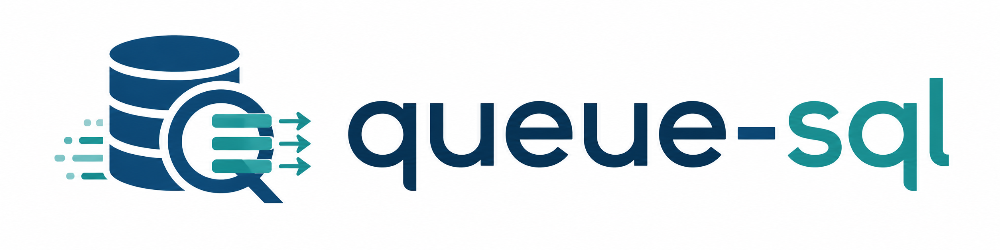

<p align="center"></p>

<p align="center">
<a href="https://github.com/kamranata/queue-sql/actions"></a>
<a href="https://packagist.org/packages/kamranata/queue-sql"></a>
<a href="https://packagist.org/packages/kamranata/queue-sql"></a>
<a href="https://packagist.org/packages/kamranata/queue-sql"></a>
</p>

Queue any Laravel write query — `delete`, `update`, `insert` — and run it across
parallel batched jobs. Built for large-scale mutations without long locks.

## Why

A single `User::where('is_blocked', true)->delete()` over millions of rows runs one giant
statement: it holds a long lock, blocks the web request, strains replication, and often hits
the request or worker timeout.

`queue-sql` turns that one statement into many small, parallel jobs. It reads the min/max
primary key under your constraints, splits the key space into `chunk`-sized ranges, and
dispatches one batched job per range. Each job re-applies your original `WHERE` and mutates
only its own slice — so every statement is small and bounded, locks stay short, and the work
runs on your queue workers instead of the request.

You keep the fluent Eloquent API you already know, and get batch progress, retries, throttling,
and `then`/`catch`/`finally` callbacks for free.

## How it works

```
queue() macro  →  capture WHERE as a portable SQL fragment  →  plan PK ranges
              →  one batched job per range  →  Bus::batch (parallel workers)
```

- Constraints are captured as a compiled SQL fragment plus bindings, so **every** `where` type
  — flat, nested closures, `whereHas`, `whereExists`, sub-selects — survives the queue boundary
  and stays fully parameterized (injection-safe).
- Delete/update by primary-key range are **idempotent**, so a retried job is safe.
- No single incrementing integer key? The operation falls back to one job (still queued).

## Install

```bash
composer require kamranata/queue-sql
php artisan queue:batches-table   # required: job_batches table
php artisan migrate
php artisan vendor:publish --tag=queue-sql-config   # optional
```

## Usage

```php
use App\Models\User;

User::where('is_blocked', true)
    ->queue(chunk: 5000, tries: 3, backoff: 30, onQueue: 'cleanup', throttle: 10)
    ->delete()
    ->then(fn () => Log::info('done'))
    ->catch(fn (Throwable $e) => Log::error($e))
    ->dispatch();

// Preview without dispatching:
User::where('is_blocked', true)->queue(chunk: 5000)->delete()->dryRun();
// => ['operation' => 'delete', 'table' => 'users', 'jobs' => 40, 'ranges' => 40, 'estimatedRows' => 190234]

// Update:
User::where('last_login', '<', now()->subYear())
    ->queue(chunk: 2000)
    ->update(['status' => 'dormant'])
    ->dispatch();

// Insert (fans out over the row array):
DB::table('imports')->queue(chunk: 1000)->insert($millionRows)->dispatch();
```

Each dispatch returns Laravel's `Illuminate\Bus\Batch`, and its batch is named
`queue-sql:{operation}:{table}` — e.g. `queue-sql:delete:users` — so runs are easy to
find and filter in `job_batches` or Horizon:

```php
$batch = User::where('is_blocked', true)->queue(chunk: 5000)->delete()->dispatch();
$batch->id; // persist this to check progress / cancel later
```

## Parameters (`queue(...)`)

| Param | Meaning | Default |
|---|---|---|
| `chunk` | rows per job | `1000` |
| `maxJobs` | cap total jobs (auto-sizes `chunk`) — mutually exclusive with `chunk` | none |
| `tries` | per-job retries | `1` |
| `backoff` | seconds between retries | `0` |
| `onConnection` | queue connection | default |
| `onQueue` | queue name | default |
| `throttle` | max jobs/second | none |
| `delay` | seconds before jobs start | none |

Every param resolves in this order: **explicit `queue(...)` argument → `config/queue-sql.php`
default → built-in fallback** (the *Default* column above). Publish the config to set your own
defaults once, globally:

```php
// config/queue-sql.php
return [
    'chunk' => 1000,
    'tries' => 1,
    'backoff' => 0,
    'connection' => null,   // null = Laravel's default connection
    'queue' => null,        // null = default queue name
    'throttle' => null,     // null = no throttle
    'delay' => null,        // null = no delay
];
```

Note: because a `null` argument means "fall back to config", you cannot pass `throttle: null`
at the call site to *disable* a throttle configured globally — set `throttle: 0`-style opt-outs
are not supported for it. `delay: 0` does work as an explicit per-call override.

`maxJobs` is opt-in and has **no** config default — it never competes with the configured
`chunk`.

### `maxJobs` — size by job count instead of chunk

When you care about "how many jobs" rather than "how many rows per job", pass `maxJobs`. It
auto-sizes the chunk so the fan-out produces at most that many jobs:

```php
// At most 50 jobs, whatever the table size:
User::where('is_blocked', true)->queue(maxJobs: 50)->delete()->dispatch();

// insert: at most 20 jobs across the row array
DB::table('imports')->queue(maxJobs: 20)->insert($millionRows)->dispatch();
```

`chunk` and `maxJobs` are mutually exclusive — passing both throws `InvalidArgumentException`.
For range fan-out (`delete`/`update`) the cap is derived from the **primary-key span**
(`ceil(span / maxJobs)`), so with sparse keys individual jobs may cover uneven row counts; the
job *count* is still bounded. `insert` derives it from the row count directly.

## Benchmark

A plain mass delete runs one statement that holds a lock for its entire duration; queue-sql
splits it into many small statements, so the longest single lock is a fraction of that. Measure
it on your own database:

```bash
php benchmarks/lock_duration.php 200000 5000
```

In a quick local run (SQLite, 20k rows, chunk 2k) the baseline's longest lock was ~3.6× the
longest lock under queue-sql. On MySQL or Postgres with millions of rows and real lock
contention the gap is far larger — point the script at your database with
`DB_CONNECTION=mysql …` to see your own numbers.

## Limitations (v1)

- **Reads are not supported** — write operations only.
- **Fan-out needs an incrementing integer primary key.** Other keys fall back to a
  single job (still queued). All `where` types (including nested closures, `whereHas`,
  `whereExists`, sub-selects) are supported.
- **`insert` is not idempotent** — a retry can duplicate rows. Guard with unique
  indexes / `insertOrIgnore` at the DB level.
- **Throttle/delay staggering relies on the queue driver honoring per-job delay** —
  the database and redis drivers do; SQS caps delay at 15 minutes.
- **Fan-out plans the primary-key range at dispatch time** — rows inserted afterward
  with a key above the captured max are not processed by that run.

## Requirements

Laravel 10–13, PHP 8.1+.
